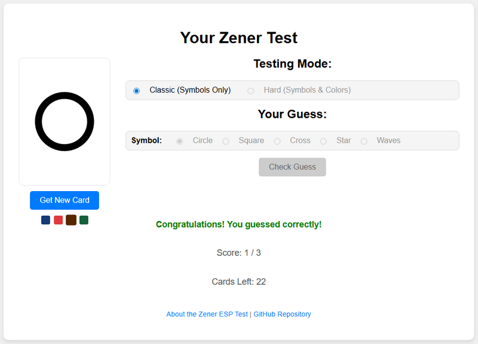

# Zener ESP Test

  

[**DEMO**](https://pvproject.free.nf/zener/index.html)

This repository contains the code for an interactive web-based Zener ESP Test, designed to explore forms of extrasensory perception, specifically clairvoyance. Users attempt to identify the symbol and/or color of a hidden Zener card.

## Overview

The Zener ESP Test is a classic experiment used to investigate extrasensory perception (ESP). This web application provides a user-friendly platform to conduct such tests, allowing participants to guess hidden card attributes and compare their results against chance levels. It's a fun and engaging way to explore intuition and perception.

## Features

* **Classic (Symbols Only) Mode:** Test your intuition by guessing one of five unique Zener card symbols (Circle, Square, Cross, Star, Waves).
* **Hard (Symbols & Colors) Mode:** A more challenging mode where you must correctly identify both the symbol and one of five distinct colors (Black, Red, Blue, Green, Yellow) for each card.
* **Interactive Card Flipping:** Visually appealing animations for drawing and revealing cards.
* **Score Tracking:** Tracks your correct guesses against the total attempts.
* **Chance Level Comparison:** Provides immediate feedback on whether your score is above, below, or close to statistical chance levels.
* **Configurable Card Backs:** Choose from different card back colors (Blue, Red, Brown, Green).
* **Informative "About" Section:** Detailed explanations of the test modes, statistical significance (for entertainment purposes), and how to interpret results.
* **Responsive Design:** Optimized for various screen sizes.

## How It Works

The test generates a shuffled deck of Zener cards based on the selected game mode. When "Start Test" or "Get New Card" is clicked, a card is drawn from the deck and presented face down. The user then selects their guess (symbol only or symbol and color) and clicks "Check Guess." The card is revealed, and the guess is evaluated, updating the score and providing instant feedback. The game continues until all 25 cards are drawn, after which final results are displayed comparing the user's score to statistically expected chance levels.

## Technologies Used

* **HTML5:** For the page structure.
* **CSS3:** For styling and animations.
* **JavaScript:** For game logic, interactivity, and dynamic content updates.

## Usage

1.  **Select Test Mode:** Choose between "Classic (Symbols Only)" or "Hard (Symbols & Colors)" mode at the beginning of a round.
2.  **Choose Card Back (Optional):** Select your preferred card back color.
3.  **Start Test:** Click the "Start Test" button to draw the first card.
4.  **Make Your Guess:** Select your symbol (and color, if in Hard mode) using the radio buttons.
5.  **Check Guess:** Click "Check Guess" to reveal the card and see if you were correct.
6.  **Continue:** Click "Get New Card" to proceed with the next card until the deck is finished.
7.  **View Results:** After all cards are tested, click "See Test Results" to view your final score and analysis.
8.  **Learn More:** Click "About the Zener ESP Test" for detailed explanations of the test and scoring.

## About the Zener ESP Test

The Zener ESP test is a classic method developed by parapsychologists Karl Zener and J. B. Rhine in the 1930s. It's designed to test for forms of extrasensory perception (ESP), primarily clairvoyance (the ability to gain information about an object or event without using known senses).

### How the Test Works:

* A deck of 25 Zener cards is used. Each card has one of five distinct symbols: a circle, a square, a cross, a star, or three wavy lines.
* In the "Classic (Symbols Only)" mode, you guess the symbol on a card that is hidden from your view.
* In the "Hard (Symbols & Colors)" mode, each symbol also has one of five distinct colors (Black, Red, Blue, Green, Yellow), and you must guess both the symbol and the color.
* For each guess, the card is revealed, and your answer is compared to the actual card.

### Interpreting Your Score (for entertainment purposes):

In a standard 25-card Zener test where you guess one of five symbols, the expected number of correct guesses by pure chance is 5 (25 total cards / 5 symbols = 5 correct guesses).

#### In Classic (Symbols Only) Mode (25 cards):

* A score of **8 or more** correct guesses is statistically significant (meaning there's only about a 10.9% chance of getting it randomly).
* A score of **10 or more** correct guesses is considered highly significant (about 1.18% chance randomly).
* A score of **15 or more** is extremely rare by chance (roughly 1 in 73,700). Such a result would be highly unusual and warrants further investigation in a scientific context.

#### In Hard (Symbols & Colors) Mode (25 cards):

* Remember, the chance level here is 1 correct guess.
* A score of **3 or more** correct guesses would be considered very significant, as it's three times the expected random score.
* A score of **5 or more** would be extremely rare by chance in this more challenging mode.

It's crucial to understand that these thresholds are for illustrative purposes within the context of this test. For a more rigorous scientific assessment of ESP, experiments require very strict controls, a much larger number of trials, and complex statistical analysis.

## Mathematical Model of the Zener ESP Test Operation

The operational mathematical model of this Zener ESP Test is governed by the algorithms for deck creation, shuffling, and guess evaluation, ensuring a fair and statistically sound basis for the test.

### 1. Deck Creation (`createDeck` Function)

The test generates a deck of 25 Zener cards. The composition of the deck varies based on the selected game mode:

* **Classic (Symbols Only) Mode:**
    * The `SYMBOLS` array `["Circle", "Square", "Cross", "Star", "Waves"]` defines the five unique symbols.
    * The deck is populated by pushing each of these five symbols **five times** into the deck array. This results in a total of 25 cards, with an equal distribution of each symbol (5 of each).
* **Hard (Symbols & Colors) Mode:**
    * In addition to the `SYMBOLS`, the `COLORS` array `["Black", "Red", "Blue", "Green", "Yellow"]` defines the five unique colors.
    * The deck is created by generating **all 25 unique combinations** of symbols and colors. Each symbol is paired with each color exactly once. This ensures that every possible symbol-color pair (e.g., "Circle-Black", "Square-Red") appears exactly once in the 25-card deck.

### 2. Deck Shuffling (`shuffleArray` Function)

Once the deck is created, it is thoroughly shuffled using a common **Fisher-Yates (Knuth) shuffle algorithm**. This algorithm ensures that every possible permutation of the deck is equally likely.

The shuffle operates as follows:
* It iterates backward from the last element to the second element of the array (`i` from `array.length - 1` down to `1`).
* In each iteration, it generates a random index `j` such that `0 <= j <= i`.
* It then swaps the element at index `i` with the element at index `j`.

This process guarantees that the order of the cards is truly random before the test begins, preventing any predictable patterns that could influence the participant's guesses or invalidate the statistical analysis.

### 3. Guess Evaluation (`checkGuess` Function)

After a card is drawn and the user makes a guess, the `checkGuess` function compares the user's input with the actual card's attributes.

* **Comparison Logic:**
    * The user's guessed symbol is compared directly with the `currentCard.symbol`.
    * If in "Hard (Symbols & Colors)" mode, the user's guessed color is also compared directly with the `currentCard.color`.
* **Scoring:**
    * A correct guess increments the `score` variable.
    * In "Classic (Symbols Only)" mode, a guess is correct if `guessedSymbol === currentCard.symbol`.
    * In "Hard (Symbols & Colors)" mode, a guess is correct only if `guessedSymbol === currentCard.symbol` **AND** `guessedColor === currentCard.color`.

This systematic approach ensures that the test adheres to the principles of a controlled experiment, allowing any results deviating significantly from chance to be noteworthy (for entertainment purposes, as specified in the "About" modal).

## Contribution

Feel free to fork this repository and submit pull requests for any improvements or bug fixes.

## License

This project is licensed under the **GNU Lesser General Public License Version 3** - see the `LICENSE` file for details.
